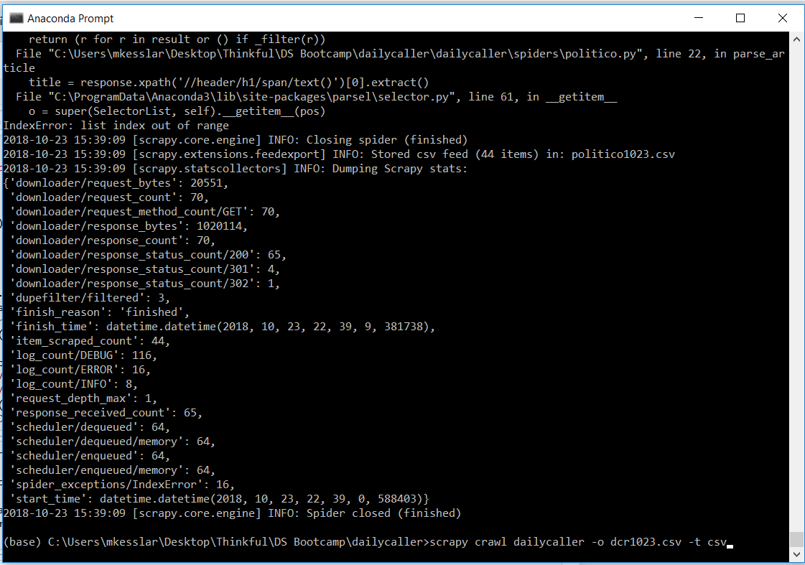
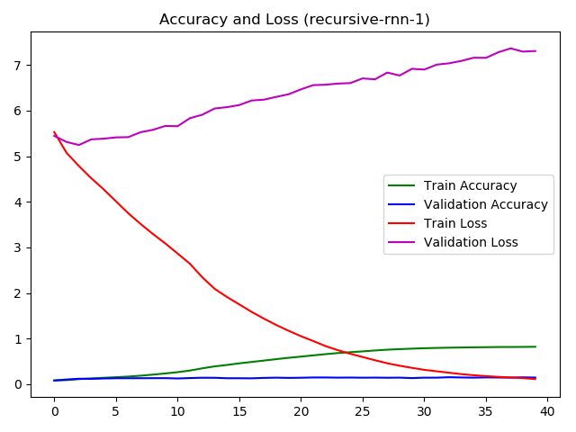

# Thinkful Data Science Final Capstone
## News Article Summarization Using Keras RNNs

Facing an increasingly polarized readership, news publications commonly resort to biased journalism along a sociopolitical spectrum of left or right leaning subjectivity. Websites like Vox and Breitbart News cover many of the same stories, but from entirely different perspectives intended to enhance the confirmation bias of the reader, a proven customer retention strategy. 

A recently created website, [Knowhere](http://www.knowhere.com) attempts to appease both sides and the middle by publishing news stories three ways, with labels of "Impartial", "Left", & "Right" readers can choose from. This is accomplished using a combination of human editors, scraping AI, and NLP machine learning models used to encode and decode the articles according to weights. 

A crucial aspect of the NLP models is the summarization of published news articles. This presents a particular challenge as articles are often 700+ words. Smaller texts, like tweets, comments, and product reviews are often only a few hundred characters presenting a single idea. News articles give backstory, context, and different perspectives (even if only to marginalize that perspective). 

In this capstone I have attempted to create a text summarizer for 3,000 articles published in September and October 2018 on four websites, listed left to right by subjective bias in journalism from left to right Huffington Post, Politico, BBC US, and The Daily Caller. 

## Step 1: Gathering Data

First, I created a spider to scrape the websites across their respective front pages, going into each article to capture the headline, date, and article text. I did this every 48-72 hours using four separate .py files (dc_recursive, huffpo, politico, & bbcus).

The Daily Caller csv is obtained by running a scrape in Command using Sublime text editor code:

scrapy crawl dailycaller -o dcrXXXX.csv -t csv ("XXXX" indicating the date of the scrape) 

The same can be done for similar scraping code written for Politico (politico), Huffington Post (huffpo) and BBC US (bbcus). For each scrape's CSV I manually inspect the articles and eliminate those where the scrape failed to properly collect the headline or article. This was most common in BBC US articles that would often using a recurring headline for geographic areas or topics such as "Africa" and "Health", usually accounting for approximately 30% of BBC scrapes. Just as common, though to a lesser extent, about 5% of The Daily Caller articles, mostly from the "Opinion" section would return empty space for the article.

Next I read the CSVs each containing the Date/Time stamp, Published Headline, and Article:

* The Daily Caller - 1085 articles
* Huffington Post - 466 articles
* Politico - 906 articles
* BBC America - 545 articles

## Step 2: Preprocessing

- [x]  Cleaning the text
- [x]  Parsing
- [x]  Lemmatizing
- [x]  Removing tags, whitespace, & labels
- [x]  Rejoining all tokens to articles 

## Step 3: Summarizations

Next came a series of summarization tactics, mostly using Recurrant Neural Networks with many permutations (layers, parameters, regulators, weights, etc.) and using both Word2Vec and GloVe word embeddings. However, after exhaustive experimentation, even the best attempts at summarization yielded results little better than:

Original Headline  | Article Summary
------------ | -------------
Trump Condemns Democrats For Being ‘Unfair’ To Kavanaugh’s Family  | trump says says for for for kavanaugh for 
Journalists Trash Porn Star Attorney For His Dubious Kavanaugh Allegations | the end of america
OPINION: Hurricane Hyperbole — Politicizing Tragedy | world war 3 is not a trump

## Conclusion

Despite using over a dozen variations of RNNs, GloVe embeddings, Seq2Seq modeling, and a variety of hyperparameter adjustments, some of which were left out of this Notebook, over the course of weeks I can see that the RNN is still encountering great difficulty summarizing against large text files like full news articles. While accuracy increases in the overall training set, validation accuracy improves somewhat, but not nearly enough to summarize the entire article. 

A potential course of action for future development may be to summarize individual paragraphs or even sentences in articles, combine those summaries into new DataFrames train/test splits and attempt summarizations on the summaries. 

At the time of this writing Google is days away from releasing a bidirectional transformer system, currently known through its AI paper "Google BERT: Pre-training of Deep Bidirectional Transformers for Language Understanding". A bidirectional approach may yield better results than feed-forward designs. 

Also, a current trend moving away from RNNs entirely is being promoted by Cornell University in the paper ["Attention Is All You Need"](https://arvix.org/abs/170603762). This process declares that using a simpler network architecture, one based solely on attention mechanisms. This is worth investigating as well. 

Text summarization can be used to simplify news articles in ways that semantic analysis does not and potentially be used to create models that compare the objective summaries to the published headlines so to identify sensationalist, "clickbait" style journalism. Though this pipeline has not yielded the desired results so far and the time to present as a final capstone has come, I intend to continue working on text summarization as a specialization under the NLP umbrella. 
